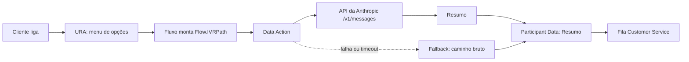

# URA com resumo por IA: Genesys Cloud Architect + Claude

Fluxo de atendimento (Inbound Call Flow) que registra o caminho do cliente no URA e, antes de transferir para um agente, pede à API da Anthropic (Claude) um resumo curto da interação. O resumo chega ao agente como Participant Data.

> **Projeto de estudo.** A seguradora "Securitem" é fictícia e todos os testes usaram dados de teste.

## O problema

Depois de passar pelo URA, o cliente costuma ter que repetir tudo para o agente, que recebe a chamada sem contexto. Este projeto testa uma forma de entregar esse contexto automaticamente.

## Como funciona

1. O cliente escolhe uma opção no menu (1 = seguro auto, 2 = seguro de vida).
2. A cada passo, o fluxo acrescenta um texto à variável `Flow.IVRPath`, por exemplo: `Inicio | seguro auto | Transfere para um agente |`.
3. Antes do transfer, uma **Data Action** envia esse caminho para a API da Anthropic.
4. O resumo devolvido é gravado no atributo `Resumo` da interação.
5. A chamada é transferida para a fila **Customer Service**.

### Recursos de robustez

- **Fallback**: se a API falhar ou demorar, o atributo `Resumo` recebe o caminho bruto do cliente, e a chamada segue normalmente.
- **Loop de tentativas**: até 3 tentativas para opção inválida ou falta de resposta, e cada erro fica registrado no caminho.
- **Falha na transferência**: se o Transfer to ACD falhar, o cliente ouve uma mensagem antes da desconexão.

## Estrutura do repositório

| Pasta | Conteúdo |
|---|---|
| `flow/` | Fluxo exportado do Architect (YAML) |
| `data-action/` | Data Action exportada (JSON), sem credenciais |
| `prompts/` | Prompt do sistema e sua evolução |
| `docs/` | Diagrama e prints, sem dados sensíveis |

## A Data Action

- **Integração**: Web Services Data Actions, com credencial *User Defined* (campo `apiKey`).
- **Endpoint**: `POST https://api.anthropic.com/v1/messages`
- **Headers**: `x-api-key: ${credentials.apiKey}`, `anthropic-version: 2023-06-01`, `Content-Type: application/json`
- **Modelo**: [modelo usado, ex.: claude-haiku-4-5]
- **Entrada**: `ivrPath` (string)
- **Saída**: `summary` (string), extraído de `$.content[0].text`

## Aprendizado: o prompt faz parte do design do fluxo

Na primeira versão do prompt, o resumo dizia que o cliente "solicitou" a transferência para um agente, mas a transferência era uma ação automática do fluxo. O modelo só sabe o que é informado a ele, então interpretou o passo como um pedido.

A versão corrigida explica o que cada passo significa, pede um resumo objetivo de 1 a 2 frases e proíbe inventar o motivo da ligação. Os dois prompts e a comparação estão em [`prompts/system-prompt.md`](prompts/system-prompt.md).

**Exemplo** (substitua pelo resultado real do seu teste):

- Caminho: `Inicio | seguro auto | Transfere para um agente |`
- Resumo: [texto gerado pela versão 2 do prompt]

## Como reproduzir

Pré-requisitos: uma organização Genesys Cloud com Architect e uma chave de API da Anthropic.

1. Crie uma integração **Web Services Data Actions** com credencial *User Defined* e o campo `apiKey`.
2. Importe a Data Action de `data-action/`, revise o modelo e o prompt, e **publique**.
3. Importe o fluxo de `flow/` no Architect. Depois da importação, confira o mapeamento no **Call Data Action** (entrada `ivrPath`, saída `summary`) e a fila de destino.
4. Associe um número ou uma rota ao fluxo, valide e publique.
5. [Opcional] Crie um Script para o agente, com uma variável `Resumo` (String, Input) e associe-o à fila.

## Segurança e privacidade

- A chave da API fica só na credencial da integração. Nenhum arquivo deste repositório contém chaves ou IDs da organização.
- O projeto envia à API apenas o caminho do menu. Em produção, avalie o que pode ser enviado a um serviço externo e a exigência de conformidade (como a LGPD).

## Limitações

- O resumo depende do que está no caminho. Com só cliques em menu, o modelo acrescenta pouco além do que já se sabe.
- A chamada à API adiciona latência e custo por ligação.
- O texto é gerado por IA e pode conter imprecisões, então o script deve indicar isso ao agente.

## Próximos passos

- [ ] [Script do agente exibindo o resumo]
- [ ] Enriquecer o caminho com dados coletados (reconhecimento de voz, consultas em outros sistemas)
- [ ] Registrar a origem do resumo (IA ou fallback)
- [ ] Medir a latência da Data Action

## Licença

MIT
